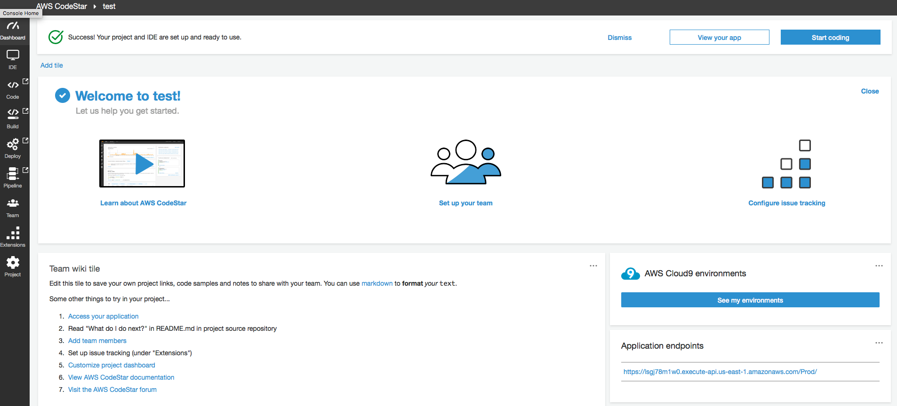

# Introduction 
This section walks you through the creating CICD pipeline by AWS CodeStar and development environment using AWS Cloud9. This will provide you with a cloud-based integrated development environment (IDE) that will let you write, run, debug, and deploy serverless application using just a web browser.

## Prepare the C9 & CICD environment

>Make sure your are in US East (N. Virginia), which short name is us-east-1.

### Create project via AWS CodeStar

* Sign in to the AWS Management Console,<br>and then open the AWS CodeStar console at https://console.aws.amazon.com/codestar/.
* On the **AWS CodeStar** page, choose **Create a new project**.</br> (If you are the first user to create a project, choose Start a project.)
* On the **Choose a project template** page, choose **Python web application with Serverless** </br> 
* On the **Project details** page, type a name for this project. </br>
Select **AWS CodeComit** for repository and type the name for repository.</br>Choose **Next**. 
> Remember your ***project name***, we'll use it later.
* Review the resources and configuration details.</br>Choose **Create Project**, and continue to setup IDE editor.

### Launch AWS Cloud9 environment

* On the **Pick how you want to edit your code** page, choose **AWS Cloud9** and choose **Next**. 
* On the **Set up your AWS Cloud9 environment** page, leave it as default and choose **Next** to complete setup. </br> 
* After environment setup, click **IDE** on left negative bar, and choose **Open IDE** to access AWS Cloud9 IDE,.

## Overview


## Deploy SAM

### Add permissions to CloudFormation Role
This step help us attach permissions to CloudFormation role to provision resources needed for deploying SAM. </br>
The role name likes "___CodeStarWorker-<CODESTAR_PROJECT_NAME>-CloudFormation___". </br>
Policies:
* AWSLambdaFullAccess
* IAMFullAccess
* CloudWatchFullAccess
* AWSCodeDeployFullAccess
> For details, please refer [Adding and Removing IAM Policies](https://docs.aws.amazon.com/IAM/latest/UserGuide/access_policies_manage-attach-detach.html#add-remove-policies-console) 

### Initial with lab material
Deploy the lab sources instead of sample code from template.
```
$ git clone https://github.com/ecloudvalley/Run-Serverless-CICD-Pipeline-with-AWS-CodeStar-and-Develop-with-AWS-Cloud9.git
$ cd <CODESTAR_PROJECT_NAME>
$ rm -rf buildspec.yml index.py README.md template.yml tests
$ cp -R ../Run-Serverless-CICD-Pipeline-with-AWS-CodeStar-and-Develop-with-AWS-Cloud9/* ./
```

### Commit & push to AWS CodeCommit 
Update lab sources to repository.
```
$ git add .
$ git status
$ git commit -m "First deploy SAM"
$ git push
```

After pushing, verify the deployment stage on **CodeStar project dashboard**, </br>
or turn on **AWS CodePipeline** to verify by clicking on "CodePipeline" URL in the "Outputs" tab of CloudFormation.

### Test
```
$ while true; do curl -s <API_ENDPOINT>; echo; sleep 1; done
```
> You can get the <API_ENDPOINT> from AWS CodeStar dashboard. </br>
> And exit the loop with `ctrl+c`.

## Local testing via SAM CLI
**SAM** is the AWS CLI tool for managing Serverless applications written with [AWS Serverless Application Model (AWS SAM)](https://github.com/awslabs/serverless-application-model). SAM CLI can be used to test functions locally, start a local API Gateway from a SAM template, validate a SAM template, fetch logs, generate sample payloads for various event sources, and generate a SAM project in your favorite Lambda Runtime.
> from [AWS SAM CLI](https://github.com/awslabs/aws-sam-cli)

### Confirm SAM version
```
$ sam --version
```
> Showing built-in version of sam-cli on Cloud9, if you wanna update/install, please refer [Installing the AWS SAM CLI](https://docs.aws.amazon.com/serverless-application-model/latest/developerguide/serverless-sam-cli-install.html#serverless-sam-cli-install-upgrading).

### Test a function payload locally with Lambda function
```
$ sam local invoke --template api_template/sam_demo.yml --event event.json

2018-12-06 07:34:09 Found credentials in shared credentials file: ~/.aws/credentials
2018-12-06 07:34:09 Invoking index.handler (python2.7)

Fetching lambci/lambda:python2.7 Docker container image...................................
2018-12-06 07:34:11 Mounting /home/ec2-user/environment/demo-sam/api_template/LambdaFunction as /var/task:ro inside runtime container
START RequestId: ad94b94d-7d62-49b0-b613-016f5f2c3416 Version: $LATEST
END RequestId: ad94b94d-7d62-49b0-b613-016f5f2c3416
REPORT RequestId: ad94b94d-7d62-49b0-b613-016f5f2c3416 Duration: 1 ms Billed Duration: 100 ms Memory Size: 128 MB Max Memory Used: 14 MB

{"body": "{\"output\": \"Hello, this is from LambdaFunction folder.\", \"timestamp\": \"2018-12-06T07:34:12.618488\"}", "headers": {"Access-Control-Allow-Origin": "*", "Content-Type": "application/json"}, "statusCode": 200}
```
### Spawn a local API Gateway to test HTTP request and response functionality
```
$ sam local start-api --template api_template/sam_demo.yml

2018-12-06 07:51:47 Found credentials in shared credentials file: ~/.aws/credentials
2018-12-06 07:51:48 Mounting LambdaFunction1 at http://127.0.0.1:3000/ [GET]
2018-12-06 07:51:48 You can now browse to the above endpoints to invoke your functions. You do not need to restart/reload SAM CLI while working on your functions changes will be reflected instantly/automatically. You only need to restart SAM CLI if you update your AWS SAM template
2018-12-06 07:51:48  * Running on http://127.0.0.1:3000/ (Press CTRL+C to quit)
```
#### Sent HTTP request in another terminal
```
$ curl http://127.0.0.1:3000/
{"output": "Hello, this is from LambdaFunction folder.", "timestamp": "2018-05-12T14:59:26.623211"}
```
Now, you've learned how to develop sam and test it locally.

## Deploy SAM with Canary Deployment

### Modify "buildspec.yml", to use another SAM model 
Deploy SAM with another template, and verify the deployment process. </br>
Paste the config to buildspec.yml.

```
$ vim buildspec.yml
```
```
version: 0.2
phases:
  build:
    commands:
      - pip install --upgrade awscli
      - aws cloudformation package --template api_template/sam_demo_deploy.yml --s3-bucket $S3_BUCKET --output-template template-export.yml
artifacts:
  type: zip
  files:
    - template-export.yml
```

### Edit the output string of "api_template/LambdaFunction/index.py"
To make different on Lambda response by changing output of body.
```
$ vim api_template/LambdaFunction/index.py
```
```
import json
import datetime


def handler(event, context):
    data = {
        'output': 'This is new version deploy.', // Make this string different from previous.
        'timestamp': datetime.datetime.utcnow().isoformat()
    }
    return {'statusCode': 200,
            'body': json.dumps(data),
            'headers': {
                'Content-Type': 'application/json',
                'Access-Control-Allow-Origin': '*' // Enable CORS on API endpoint.
            }
        }
```


### Commit & push to AWS CodeCommit 
```
$ git add .
$ git commit -m "Deploy SAM with Canary"
$ git push
```

After pushing, verify the deployment stage on CodeStar project dashboard, </br>or turn on AWS CodePipeline to verify by clicking on "CodePipeline" URL in the "Outputs" tab of CloudFormation.

### Test
You will get the response on old/new response body about at 90/10 percentage, after a while, the response will show the new version.
```
$ while true; do curl -s <API_ENDPOINT>; echo; sleep 1; done
```
> You can get the <API_ENDPOINT> from AWS CodeStar dashboard.


## Deploy SAM with error to trigger roll back
In this part, we will make Lambda function response a failed message to verify the roll back actions when deploying failed.

### Modify "buildspec.yml" to use another SAM model 

```
$ vim buildspec.yml
```
```
version: 0.2
phases:
  build:
    commands:
      - pip install --upgrade awscli
      - aws cloudformation package --template api_template/sam_demo_deploy_alarm.yml --s3-bucket $S3_BUCKET --output-template template-export.yml
artifacts:
  type: zip
  files:
    - template-export.yml
```

### Throw except to response as error
This function would throw error response to API Gateway.
```
$ cat api_template/LambdaFunction_error/index.py
```
### Commit & push to AWS CodeCommit 
```
$ git add .
$ git commit -m "Deploy SAM with error to trigger roll back"
$ git push
```

After pushing, verify the deployment stage on CodeStar project dashboard, </br>or turn on AWS CodePipeline to verify by clicking on "CodePipeline" URL in the "Outputs" tab of CloudFormation.

### Test
When the response get an ***error***, that means deployment failed and will trigger roll back actions.

```
$ while true; do curl -s <API_ENDPOINT>; echo; sleep 1; done
```
> You can get the <API_ENDPOINT> from AWS CodeStar dashboard.

## Further More
Here's appendix to help you learn more between Serverless and DevOps.

* [Review CICD Pipeline](appendix-review-pipeline.md)

* [Integrate with static website](appendix-integrate-with-static-website.md)


## Clean Up
To delete the AWS resources, perform the tasks below in order:
* Delete the project from AWS CodeStar dashboard.
* Detach the 4 attached policies from CloudFormation IAM Role,</br>the role name likes "CodeStarWorker-<CODESTAR_PROJECT_NAME>-CloudFormation".
* Delete AWS CodeStar stack/template from AWS CloudFormation,</br>which named "awscodestar-<CODESTAR_PROJECT_NAME>"

## Conclusion
In this post, we demostrated:
* How to setup a continuous delivery pipeline by AWS CodeStar
* Develop with AWS Cloud9
* Preform Lambda/API Gateway testing by AWS SAM CLI (SAM Local)
* Deploy SAM within canary deployment


