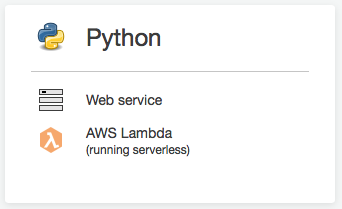
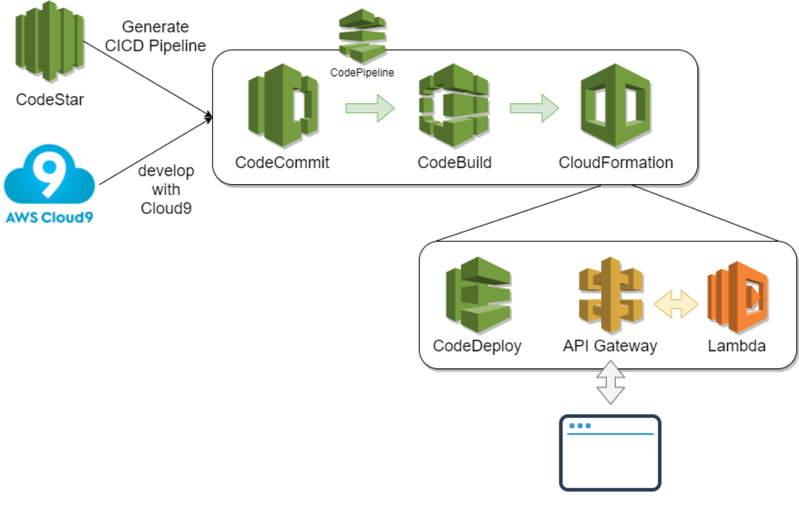

# Bootcamp-SAM-withCloud9andCodeStar
This Section walks you through the creating CICD pipeline on AWS & development environment using AWS Cloud9. This will provide you with a cloud-based integrated development environment (IDE) that will let you write, run, debug, and deploy serverless application using just a web browser.

## Prepare the C9 & CICD environment

>Make sure your are in US East (N. Virginia), which short name is us-east-1.

#### Create project via AWS CodeStar

* Sign in to the AWS Management Console, and then open the AWS CodeStar console at https://console.aws.amazon.com/codestar/.
* On the **AWS CodeStar** page, choose **Create a new project**.</br> (If you are the first user to create a project, choose Start a project.)
* On the **Choose a project template** page, choose **Python web application with Serverless** </br> 
* On the **Project details** page, type a name for this project. Select **AWS CodeComit** for repository and type the name for repository. Choose **Next**.
* Review the resources and configuration details. Choose **Create Project**, and continue to setup IDE editor.

#### Launch AWS Cloud9 environment

* On the **Pick how you want to edit your code** page, choose **AWS Cloud9** and choose **Next**. 
* On the **Set up your AWS Cloud9 environment**, leave it as default and choose **Next** to complete setup. </br> 
* After environment setup, click **IDE** on left negative bar, and choose **Open IDE** to access AWS Cloud9 IDE,.

## Overview




## Local testing via SAM CLI

#### Confirm SAM version

```
$ sam --version
```

## Deploy SAM

#### Commit & push to AWS CodeCommit 
```
$ git add .
$ git commit -m "First deploy SAM"
$ git push
```

After pushing, turn on AWS CodePipeline to verify by click on "CodePipeline" URL in the "Outputs" tab of CloudFormation.

#### Test

```
$ while true; do curl -s <API_ENDPOINT>; echo; sleep 1; done
```

## Deploy SAM with Canary Deployment


#### Modify "buildspec.yml", to use another SAM model 

```
$ vim buildspec.yml
```
```
version: 0.2
phases:
  build:
    commands:
      - pip install --upgrade awscli
      - aws cloudformation package --template api_template/demo_sam_deploy.yml --s3-bucket $S3_BUCKET --output-template template-export.yml
artifacts:
  type: zip
  files:
    - template-export.yml
```

#### Edit the output string of "api_template/LambdaFunction/index.py"
```
$ vim api_template/LambdaFunction/index.py
```
```
import json
import datetime


def handler(event, context):
    data = {
        'output': 'This is new version deploy.',
        'timestamp': datetime.datetime.utcnow().isoformat()
    }
    return {'statusCode': 200,
            'body': json.dumps(data),
            'headers': {
                'Content-Type': 'application/json',
                'Access-Control-Allow-Origin': '*'
            }
        }
```


#### Commit & push to AWS CodeCommit 
```
$ git add .
$ git commit -m "Deploy SAM with Canary"
$ git push
```

After pushing, turn on AWS CodePipeline to verify by click on "CodePipeline" URL in the "Outputs" tab of CloudFormation.

#### Test

```
$ while true; do curl -s <API_ENDPOINT>; echo; sleep 1; done
```


## Deploy SAM with error to trigger roll back

#### Modify "buildspec.yml", to use another SAM model 

```
$ vim buildspec.yml
```
```
version: 0.2
phases:
  build:
    commands:
      - pip install --upgrade awscli
      - aws cloudformation package --template api_template/demo_sam_deploy_alarm.yml --s3-bucket $S3_BUCKET --output-template template-export.yml
artifacts:
  type: zip
  files:
    - template-export.yml
```

#### Throw except to response as error
```
$ cat api_template/LambdaFunction_error/error.py
```
#### Commit & push to AWS CodeCommit 
```
$ git add .
$ git commit -m "Deploy SAM with error to trigger roll back"
$ git push
```

After pushing, turn on AWS CodePipeline to verify by click on "CodePipeline" URL in the "Outputs" tab of CloudFormation.

#### Test

```
$ while true; do curl -s <API_ENDPOINT>; echo; sleep 1; done
```

