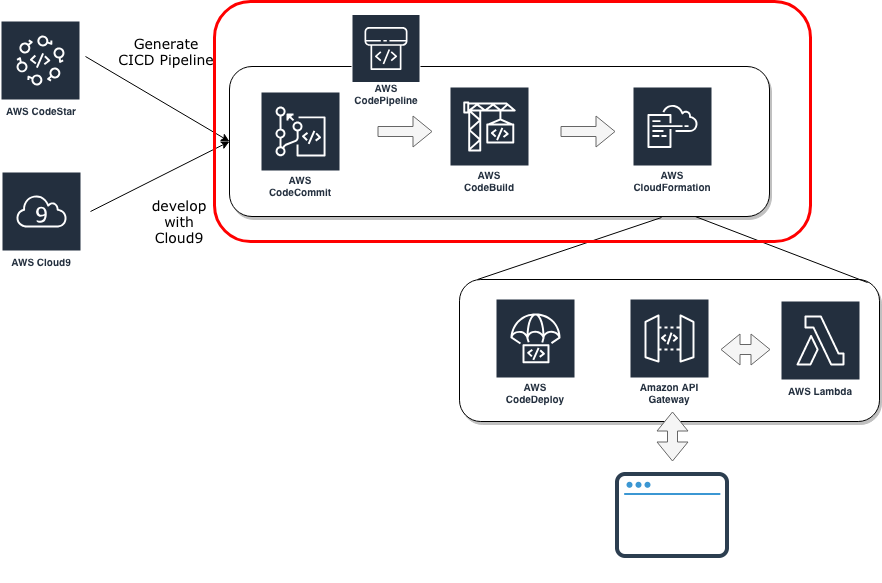
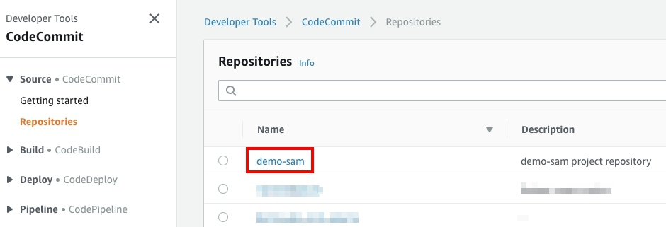
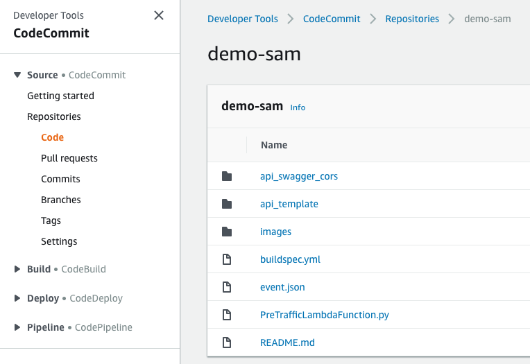
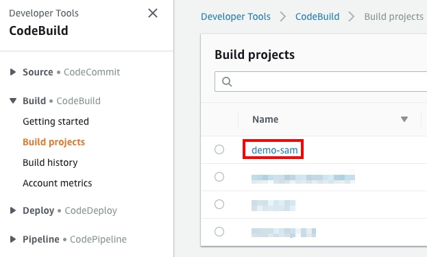
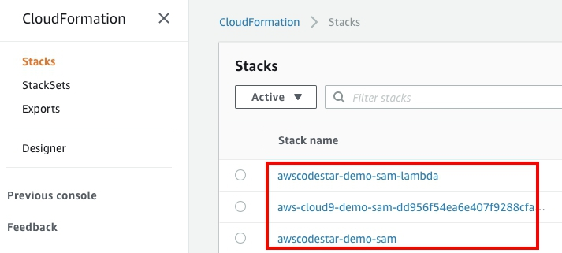
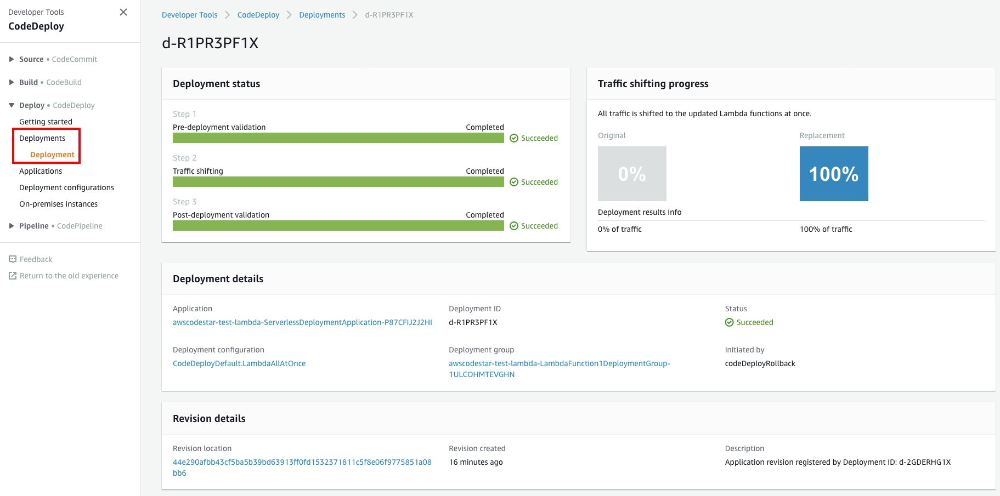
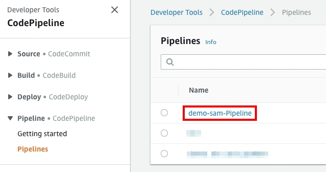

## Appendix: Review CICD Pipeline
This section walks you each services through the creating CICD pipeline by AWS CodeStar.

### Before you begin

>Make sure you've created pipeline for CICD. If not, please create it first with [Prepare the C9 & CICD environment](/README.md).

>Make the region are in US East (N. Virginia), which short name is us-east-1, or select to the right region you deployed.


## Overview

<p align="center">
    
</p>

## AWS CodeCommit Repository
AWS CodeCommit is a version control service hosted by AWS that you can use to privately store and manage assets (such as documents, source code, and binary files) in the cloud.</br>In this step, you use the AWS CodeCommit console to access your repository.

* Open the [AWS CodeCommit console](https://console.aws.amazon.com/codesuite/codecommit/home).  
* Click ***Repository*** on the left negative menu, developer tools. The console would show as below.</br> **Choose** your project name which provision by CodeStar. </br>
<p align="center">
    
</p>

* Then you could review the information of repository, like pull requests, source codes, commits..., just as git.
</br>
<p align="center">
    
</p>

> For more details about CodeCommit, please refer [AWS CodeCommit UserGuide](https://docs.aws.amazon.com/codecommit/latest/userguide/welcome.html).

## AWS CodeBuild Project
AWS CodeBuild currently supports building from the following source code repository providers. 
1. AWS CodeCommit
2. Amazon S3
3. GitHub
4. Bitbucket

The source code must contain a build specification (build spec) file, or the build spec must be declared as part of a build project definition. A build spec is a collection of build commands and related settings, in YAML format, that AWS CodeBuild uses to run a build.

* Open the ***buildspec.yml*** in repository, the sample build specification often below does the following:
	* Pre-build stage:
		* Updating awscli to newest version.		
	* Build stage:
		* Packaging SAM to CloudFormation template.
    * Generate a template configuation file which required for AWS CodeStar projects.
	* Post-build stage:
		* Export the CloudFormation template as zip. The deployment stage of your CD pipeline uses this information to create a new revision of your CloudFormation stack, and then it updates the serverless application to use the new package.

```
version: 0.2

phases:
  pre_build:
    command:
      - echo Updating awscli for newest version
      - pip install --upgrade awscli
  build:
    commands:
      - echo Build started on `date`
      - echo Packaging SAM to CloudFormatino template
      
      # Use AWS SAM to package the application by using AWS CloudFormation
      - aws cloudformation package --template api_template/sam_demo_deploy_alarm.yml --s3-bucket $S3_BUCKET --output-template template-export.yml
      
      # Do not remove this statement. This command is required for AWS CodeStar projects.
      # Update the AWS Partition, AWS Region, account ID and project ID in the project ARN on template-configuration.json file so AWS CloudFormation can tag project resources.
      - sed -i.bak 's/\$PARTITION\$/'${PARTITION}'/g;s/\$AWS_REGION\$/'${AWS_REGION}'/g;s/\$ACCOUNT_ID\$/'${ACCOUNT_ID}'/g;s/\$PROJECT_ID\$/'${PROJECT_ID}'/g' template-configuration.json
  post_build:
    commands:
      - echo Build completed on `date`
artifacts:
  type: zip
  files:
    - template-export.yml
    - template-configuration.json
```
> For more details about build specification, please refer [Build Specification Reference](https://docs.aws.amazon.com/codebuild/latest/userguide/build-spec-ref.html)

* Open the [AWS CodeBuild console](https://console.aws.amazon.com/codesuite/codebuild/home).
* Click ***Build projects*** on the left negative menu under **Build ● CodeBuild**. </br> And choose your project name which provision by CodeStar.</br>
<p align="center">
    
</p>

* In ***Build history***, you can review the log or information for every build jobs by choosing the build id.
* In ***Build detail***, you can review the build environment setting.

> For more details about CodeBuild, please refer [AWS CodeBuild UserGuide](https://docs.aws.amazon.com/codebuild/latest/userguide/welcome.html).

## AWS CloudFormation Stack
AWS SAM is a higher-level abstraction of AWS CloudFormation that simplifies serverless application development. AWS SAM template files are AWS CloudFormation template files with a few additional resource types defined that are specific to serverless applications—such as API Gateway endpoints and Lambda functions. </br>


* Open the ***api_template_/sam-demo.yml*** in repository. </br> The following AWS SAM template creates a Lambda function by using AWS SAM resource syntax, and creates an Amazon S3 bucket by using AWS CloudFormation resource syntax:
```
AWSTemplateFormatVersion: 2010-09-09
Transform:
- AWS::Serverless-2016-10-31
- AWS::CodeStar

Parameters:
  ProjectId:
    Type: String
    Description: CodeStar projectId used to associate new resources to team members
  Alias:
    Type: String
    Default: 'DemoSAM'
  Stage:
    Type: String
    Description: The name for a project pipeline stage, such as Staging or Prod, for which resources are provisioned and deployed.
    Default: ''
  
Resources:
  LambdaFunction1:
    Type: AWS::Serverless::Function
    Properties:
      Handler: index.handler
      Runtime: python3.6
      Role:
        Fn::GetAtt:
        - LambdaExecutionRole
        - Arn
      CodeUri: ./LambdaFunction
      Description: 'LambdaFunctionforDemo'
      AutoPublishAlias: !Ref Alias
      MemorySize: 128
      Timeout: 300
      Events:
        GetEvent:
          Type: Api
          Properties:
            Path: /
            Method: get
  LambdaExecutionRole:
    Description: Creating service role in IAM for AWS Lambda
    Type: AWS::IAM::Role
    Properties:
      RoleName: !Sub 'CodeStar-${ProjectId}-Execution${Stage}'
      AssumeRolePolicyDocument:
        Statement:
        - Effect: Allow
          Principal:
            Service: [lambda.amazonaws.com]
          Action: sts:AssumeRole
      Path: /
      ManagedPolicyArns:
        -  arn:aws:iam::aws:policy/service-role/AWSLambdaBasicExecutionRole
      PermissionsBoundary: !Sub 'arn:${AWS::Partition}:iam::${AWS::AccountId}:policy/CodeStar_${ProjectId}_PermissionsBoundary'


```
In the build stage, CodeBuild package SAM template to CloudFormation format, and output to S3. </br>
CloudFormation take the packaged template to generate change set and make a revision to stack for provision new version resources.

* Open the [AWS CloudFormation console](https://console.aws.amazon.com/cloudformation/home).
* On this page, you'll get 3 stacks as below:
	* awscodestar-<YOUR_PROJECT_NAME>-lambda
	* aws-cloud9-<YOUR_PROJECT_NAME>-<RANDOM_ID>
	* awscodestar-<YOUR_PROJECT_NAME>

<p align="center">
    
</p>

* Choose either one stack.
* In ***stack details***, you can get the stack info, deploy events, provisioned resources, deploy output,or event template source code.
* In ***Change sets*** on left negative menu under stack, you can review the change set details.

## AWS CodeDeploy
AWS Lambda and AWS CodeDeploy made it possible to automatically shift incoming traffic between two function versions based on a preconfigured rollout strategy. This feature allows you to gradually shift traffic to the new function. If there are any issues with the new code, you can quickly rollback and control the impact to your application. </br></br>
In this case, CodeDeploy deployment provisioned by SAM and CloudFormation, which setup for deployment actions. That's why we attach permission to CloudFormation role to execute the SAM and CloudFormation deployment.

* Open the [AWS CodeDeploy console](https://console.aws.amazon.com/codesuite/codedeploy/home).
* Click ***Deployments*** on the left negative menu under **Deploy ● CodeDeploy**. </br> And choose any Deployment Id to review deployment.</br>
<p align="center">
    
</p>

* On this page, you can get the deployment details.

## AWS CodePipeline

* Open the [AWS CodePipeline console](https://console.aws.amazon.com/codesuite/codepipeline/home).
* Click ***Pipelines*** on the left negative menu under **Pipeline ● CodePipeline**. </br> And choose your project name which provision by CodeStar.</br>
<p align="center">
    
</p>

* On this page, you can see the stages information for pipeline.
* On the right of top, you can edit, view pipeline actions history, or release the latest change to trigger pipeline action.

> For more details about CodePipeline, please refer [AWS CodePipeline UserGuide](https://docs.aws.amazon.com/codepipeline/latest/userguide/welcome.html).

## Conclusion
In this post, we demostrated:
* What resources are provisioned by AWS CodeStar
* Access the develop tools by Console


